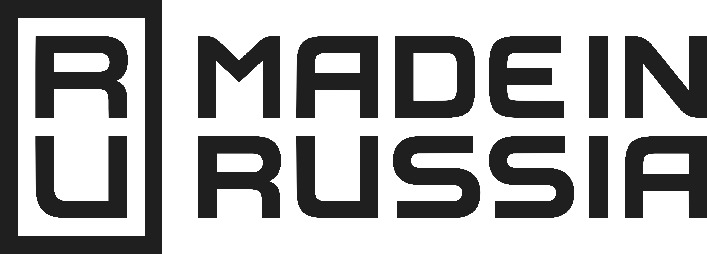

# LPMS docs

> Настоящий проект реализуется в рамках подготовки итоговой выпускной работы студента набора LPA5 курса Learn Python Advanced

Здесь размещен репозиторий с документацией LPMS.

## Что такое LPMS?

[LPMS](https://github.com/mmmylnikov/lpms) - Это система управления обучением для курсов от сообщества MOSCOW PYTHON, которая помогает организовать образовательный процесс курсов программирования Learn Python и Learn Python Advanced. 

## Возможности LPMS

- Создание и управление курсами
- Управление доступом к материалам курса
- Мониторинг успеваемости
- Интеграция с хостингом проектов (для сдачи домашних заданий)
- Гибкая система настройки курсов и учебных планов
- Сбор и анализ статистики обучения
- Автоматизация процессов управления обучением

## [Материалы](https://mmmylnikov.github.io/lpms-docs/)
- Быстрый старт
  - [Установка и настройка](https://mmmylnikov.github.io/lpms-docs/start/)
  - [Переменные окружения](https://mmmylnikov.github.io/lpms-docs/start/env/)
  - [Зависимоcти](https://mmmylnikov.github.io/lpms-docs/start/requirements/)
- Описание системы
  - [Цель проекта](https://mmmylnikov.github.io/terms/object/)
  - [Функциональные блоки](https://mmmylnikov.github.io/terms/description/)
  - [Предлагаемый стек технологий](https://mmmylnikov.github.io/terms/stack/)
  - [Требования к дизайну](https://mmmylnikov.github.io/terms/styling/)
  - [ER-модель](https://mmmylnikov.github.io/terms/erd/)
- Скриншоты интерфейса
  - [Авторизация и профили](https://mmmylnikov.github.io/lpms-docs/screenshots/auth/)
  - [Процесс обучения](https://mmmylnikov.github.io/lpms-docs/screenshots/learn/)
- Журнал разработки
  - [Задачи](https://mmmylnikov.github.io/lpms-docs/devlog/todo/)
  - [История версий](https://mmmylnikov.github.io/lpms-docs/devlog/log/)

© 2024 LPMS | Система управления курсами программирования

