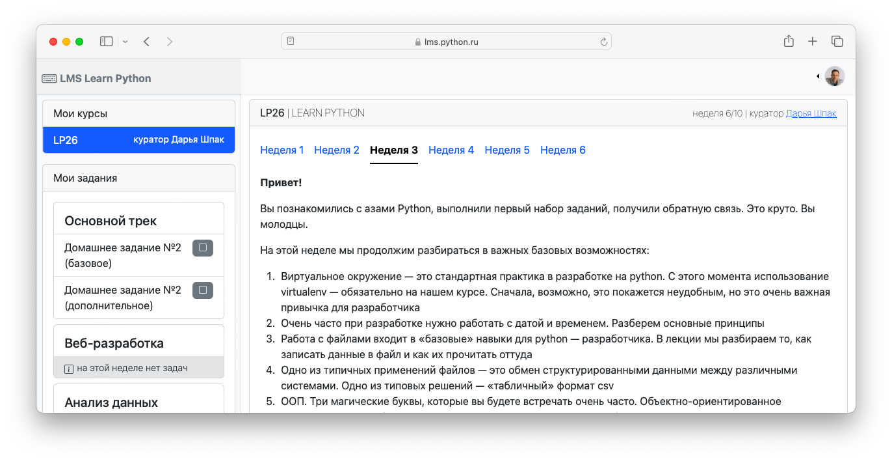
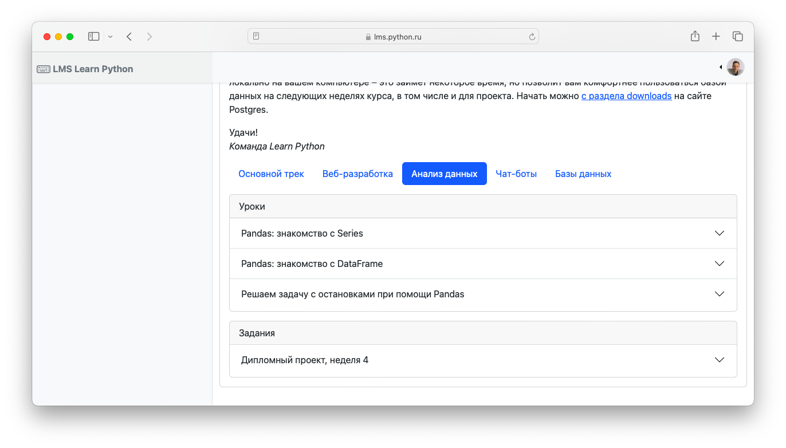
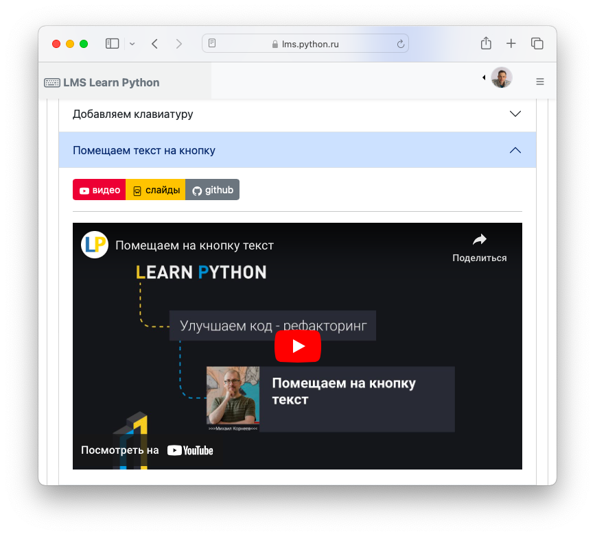
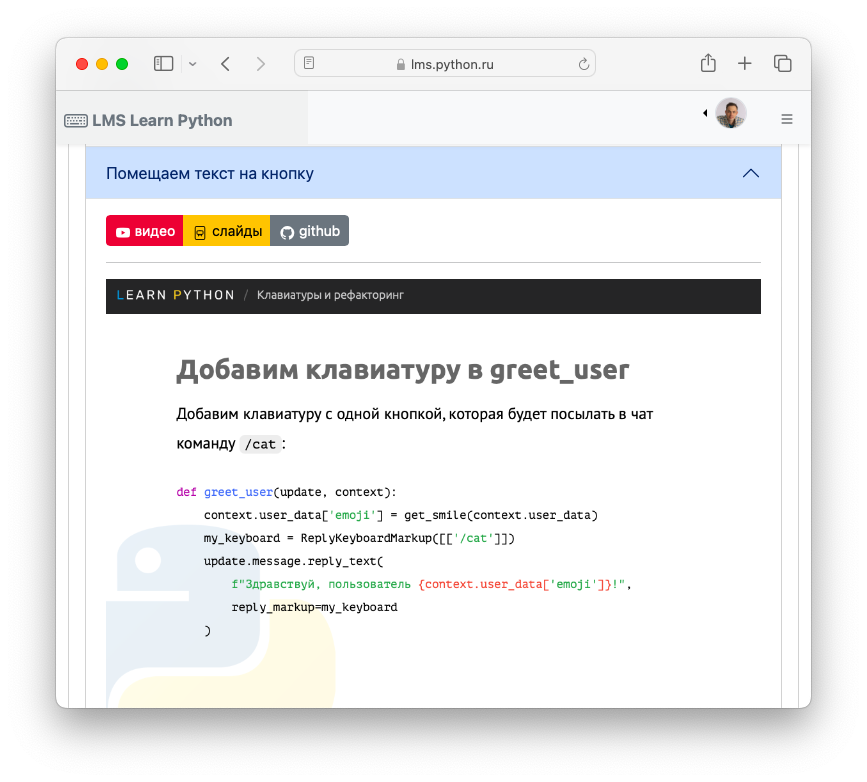
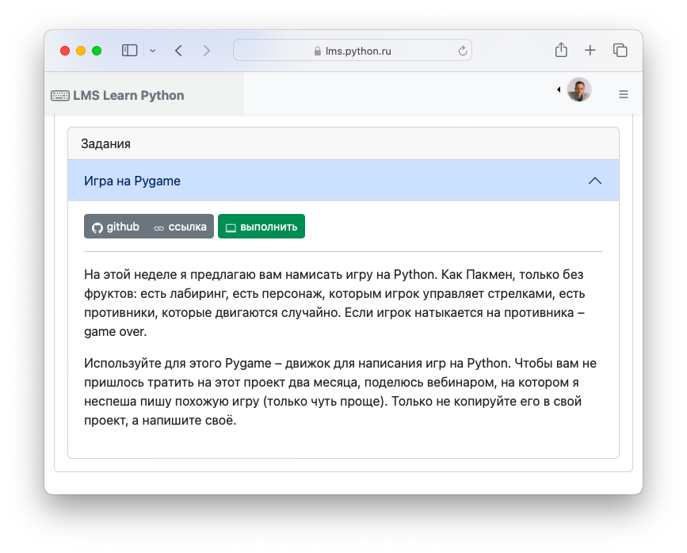

# Просмотр учебного материала

Просмотр учебного контента доступен на дашбордах `Студента` и `Куратора`.

Важные принципы организации учебного процесса:

- Учебные материалы представлены Уроками и Заданиями и сгруппированы по Трекам
- На Курсе может быть несколько Треков
- Курс представлен Неделями
- На каждой неделе может быть несколько Уроков и Заданий из нескольких Треков
- Учебный материал становится доступным постепенно, по мере наступления следующей календарной недели в рамках срока обучения учебного Потока

Рассмотрим возможности просмотра учебных материалов на примере дашбоарда Студента.

## Навигация по неделям

На главной странице системы в разделе "Мои группы" представлены группы, в которые зачислен Студент. При переходе по ссылке Студент попадает на дашбоард. 

В верхней части дашборда находится навигация по доступным неделям. Недели становятся доступными (открываются) автоматически по календарной неделе в рамках срока обучения. В левом боковом меню представлен краткий перечень задач по каждому из треку на текущую неделю. 

## Навигация по трекам

Ниже на дашборде находится фильтр группирующий Уроки и Задания по отдельным Трекам.

## Уроки

Развернув интересующий урок, появляются кнопки загрузки контента: видео, презентации, дополнительные ссылки на материалы. Также может присутствовать текстовый контент.

### Видео

Поддерживается плеер Youtube

### Презентации

Поддерживаются слайды опубликованные на `learn.python.ru` и презентации Google Slides 

### Задания

Задания могут быть представлены текстовым описанием, репозиторием задачи и ссылками на дополнительные материалы. По кнопке "Выполнить" осуществляется переход на страницу выполнения работы.

