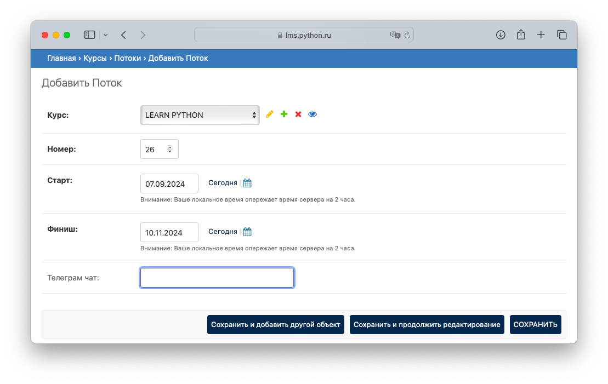
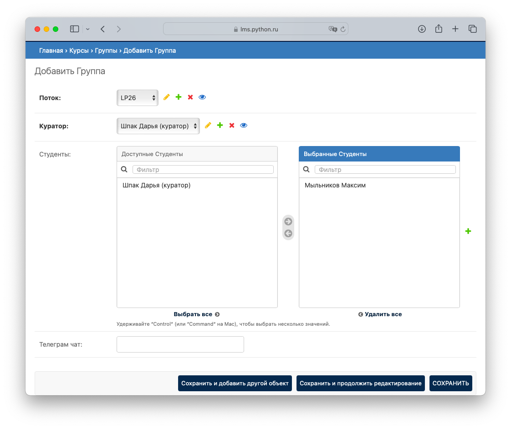
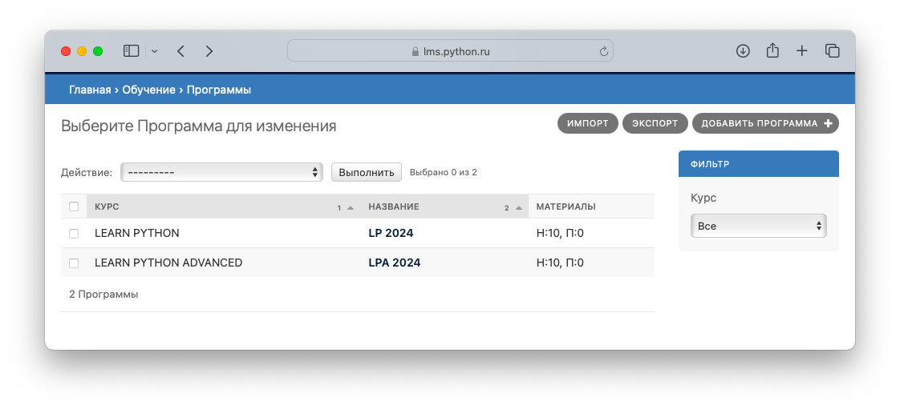
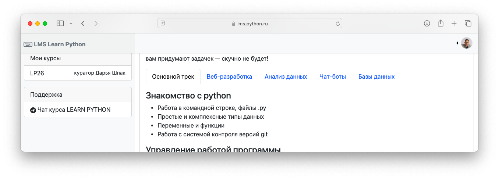
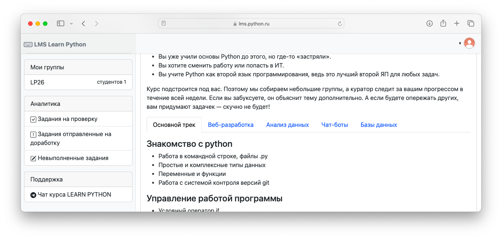
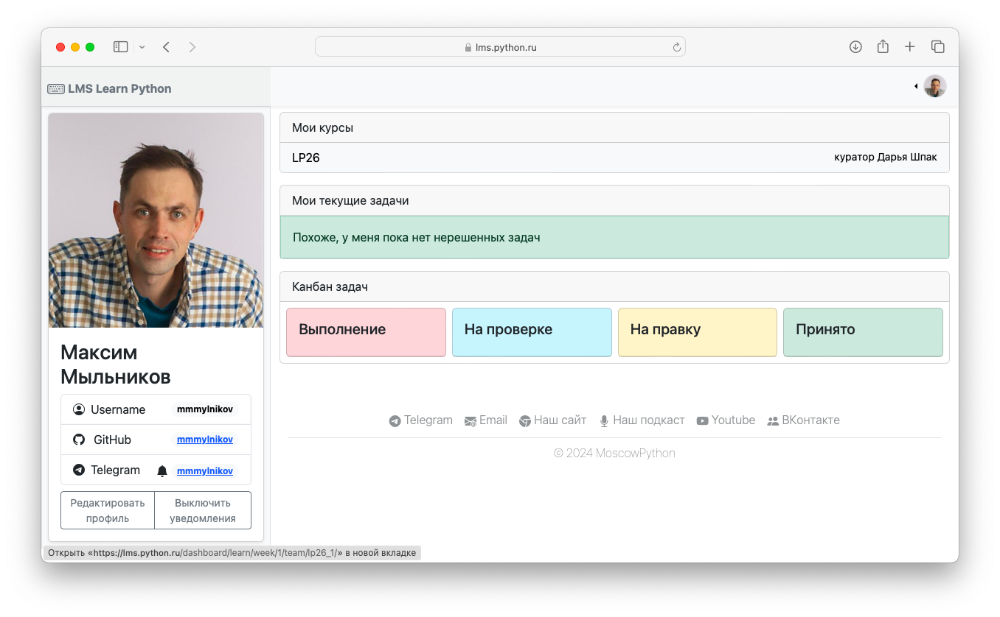

# Старт нового потока и групп

Рассмотрим пример, когда необходимо создать новый поток курса Learn Python, который будет проходить с 7 сентября по 9 ноября 2024 года.

## Создание потока

Зайдем в административную панель. Далее в разделе "Главная › Курсы › Потоки" добавим новый `Поток`.

-  Здесь `Номер` потока означает порядковый индекс потока в курсе. Например, `Поток 26` будет проходить с 7 сентября по 9 ноября 2024 года, а `Поток 27` будет проходить с 16 ноября по декабрь 2024 года и т.д.
- Если заполнить поле Telegram чат, то на дашборде студента и куратора будет отображаться соответствующая ссылка в разделе "Помошь".

## Создание групп

После создания `Потока` добавим новую `Группу`. Для этого перейдите в раздел "Главная › Курсы › Группы › Добавить Группа".

- Выберите `Куратора` который будет закреплен за данной `Группой`
- Выберите студентов, которох хотите зачислить в ранную группу
- `Групп` на `Потоке` может быть несколько
- Если заполнить поле Telegram чат, то на дашборде студента и куратора будет отображаться соответствующая ссылка в разделе "Помошь"

## Выбор программы обучения

Система поддерживает возможность совершенствовать программу обучения, при этом сохраняя историческую структуру материалов. К примеру, в 2025 году было принято решение усовершенствовать программу обучения и добавить новые задания, которые будут зафиксированы в программе 2025 года. Новые потоки студентов будут видеть актуальный учебный материал. При этом студенты обучавшиеся ранее смогут видеть старый учебный материал, в том виде, который был во время их обучения.

При инициализации в систему вы загрузили две программы: Learn Python и Learn Python Advanced.  

Чтобы назначить потоку `Программу` обучения, по которой будут обучаться студенты, перейдите в раздел "Главная › Обучение › Программы › LP 2024" 

В разделе "Потоки" программы "LP 2024" перенесите вновь созданный поток "LP26" в поле "Выбранные потоки"

!!! success "Поздравляю, можно приступать к обучению!"

Теперь у Куратора и Студентов, которые прикреплены к группе созданного потока, появятся ссылки в разделе "Мои курсы" на главной странице и в разделе "Мой профиль".

<figure markdown="span">
  
  <figcaption>Студент - главная страница</figcaption>
</figure>

<figure markdown="span">
  
  <figcaption>Куратор - главная страница</figcaption>
</figure>

<figure markdown="span">
  
  <figcaption>Профиль пользователя</figcaption>
</figure>
