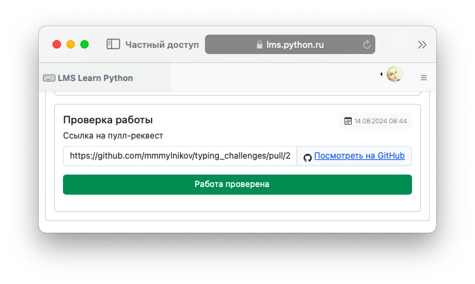

# Процесс обучения

## Как работает взаимодействие Студента и Куратора

Система выступает аудитором взаимодействия `Студента` и `Куратора` на GitHub.

Типичный кейс выполнения задания Студентом:

- студент взял задание в системе
- выполнил его на своем устройстве
- загрузил решение в репозиторий на GitHub
- создал пулл-реквест
- указал адрес пулл-реквеста в систему

При этом предусмотрены следующие сценарии, которые отрабатывает система:

- С1. Работа не отправлена
- С2. Работа отправлена на проверку
- С3. Куратор не проверил работу
- С4. Куратор принял работу
- С5. Куратор проверил работу и отправил на доработку

Рассмотрим подробнее каждый из сценариев

## С1. Работа не отправлена

+ У студента привязан GitHub аккаунт
+ Студент пытается указать адрес несуществующего пулл-реквеста, или уже закрытого пулл-реквеста или репозитория, который ему не принадлежит 
+ Система запрашивает у GitHub репозитории и пулл-реквесты студента и предлагает указать существующий.
+ Если студент указал неверный адрес (несуществующий, уже выполненный или не принадлежащий ему) - система не принимает такую работу.

<figure markdown="span">
  
  <figcaption>Отправка работы Студентом</figcaption>
</figure>

## С2. Работа отправлена на проверку

+ У студента привязан GitHub аккаунт
+ Студент указал верный адрес пулл-реквеста
+ Система сохраняет таймштамп отправки и меняет статус 

+ Если у студента включены уведомления - Система направляет в Телеграм сообщение, что статус работы изменился
+ Если у закрепленного куратора включены уведомления - Система направляет в Телеграм сообщение, что статус доступна новая работа для ревью

Куратор заходит в систему, выбирает работу для проверки, переходит по ссылке из системы в пулл-реквест студента на GitHub. 

Куратор Проверяет код. При необходимости куратор выделяет отдельные фрагменты и комментирует их (используя  функционал GitHub).

Если работа принята - куратор устанавливает для комментария статус Approved средствами GitHub.

Если работа требует исправлений - куратор устанавливает для комментария статус Reviewed средствами GitHub.

Если комментарии отсутствуют - работа считается непроверенной.

Далее Куратор возвращается в систему > Нажимает "Работа проверена"

## С3. Куратор не проверил работу

+ Система запрашивает у GitHub есть ли комментарии к пулл-реквесту от гитхаб аккаунта, который привязан к текущему куратору
+ Если комментарии к работе отсутствуют, система сообщает, что работа не проверена и показывает соответствующую ошибку Куратору

## С4. Куратор принял работу

+ Система запрашивает у GitHub есть ли комментарии к пулл-реквесту от гитхаб аккаунта, который привязан к текущему куратору
+ Если присутствует комментарий Approved система отмечает работу принятой и сохраняет таймштамп
+ Если у студента включены уведомления - Система направляет в Телеграм сообщение, что статус работы изменился
+ Если у куратора включены уведомления - Система направляет в Телеграм сообщение, что статус работы изменился

## С5. Куратор проверил работу и отправил на доработку

+ Система запращивает у GitHub есть ли комментарии к пулл-реквесту от гитхаб аккаунта, который привязан к текущему куратору
+ Если в работе имеются комментарии и среди них отсутствует комментарий Approved система отмечает работу требующей исправлений и сохраняет таймштамп
+ Если у студента включены уведомления - Система направляет в Телеграм сообщение, что статус работы изменился
+ Если у куратора включены уведомления - Система направляет в Телеграм сообщение, что статус работы изменился

!!! info "Примечание"

    Циклов `Работа на проверке > Работа требует исправлений > Работа на проверке` может быть несколько. В системе сохраняется вся история изменений. Таким образом можно отследить как менялся статус работы с течением времени.