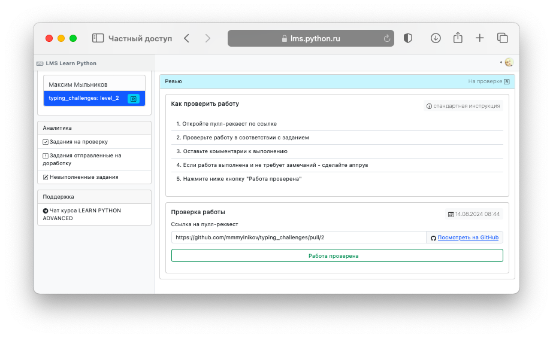
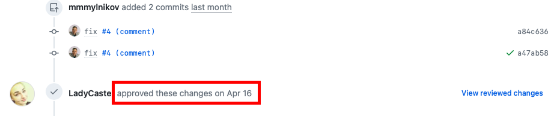
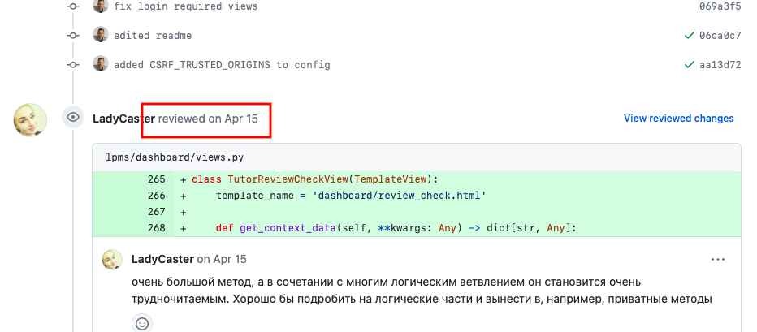
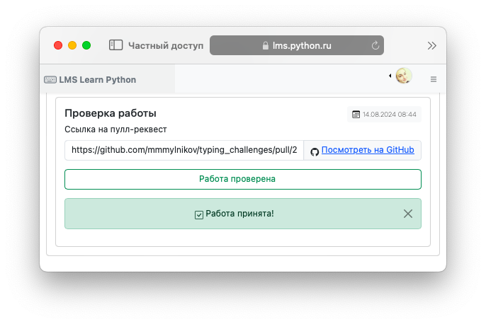
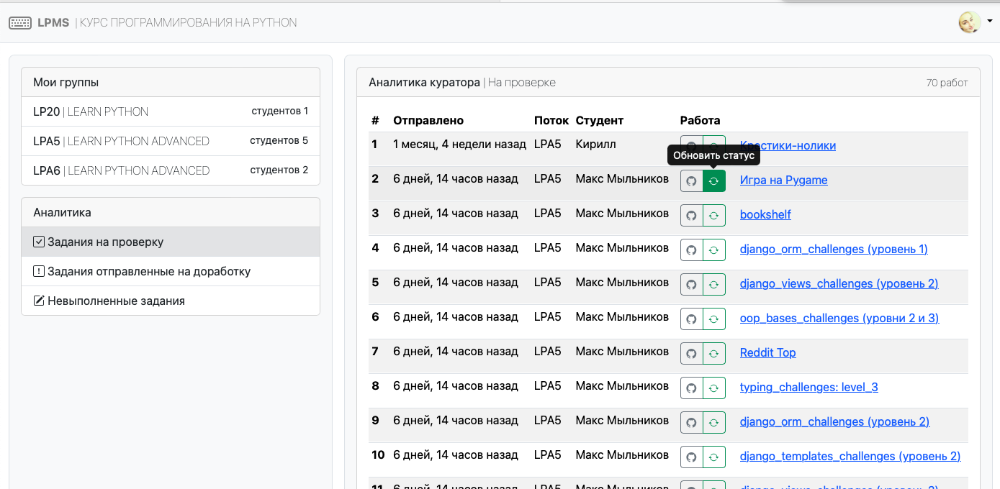

# Ревью работ

## Последовательность выполнения ревью

Подробные сценарии взаимодействия Студента и Куратора рассмотрены в разделе [Процесс обучения](../learn/learn.md)

В общем случае жизненный цикл работы студента следующий:

1) Студент форкает или создает репозиторий

2) Студент выполняет упражнения из задания

3) Студент делает пул-реквест в свой репозиторий

4) Студент сдает на проверку ссылку на пул-реквест (через форму в системе)

5) Куратор выбирает работу на проверку через интерфейс системы (получает ссылку на пул-реквест)

6) Куратор проверяет работу средствами Github

7) Если работа выполнена верно Куратор устанавливает в пулл-реквесте статус "approved"

8) Если работа требует правок Куратор комментирует проблемные места и устанавливает в пулл-реквесте статус "reviewed"

9) Куратор обновляет статус работы в системе

Как выглядит процесс выполнения работы с точки зрения студента, можно посмотреть в разделе [Выполнение заданий](../learn/task.md)

## Аналитика по курируемым студентам

Куратору доступен аналитический раздел:

- упрощает навигацию по предстоящим ревью
- позволяет оценить работу студентов на курсе
- дает возможность отслеживать успеваемость студентов

## Уведомления

Если Куратор указал в профиле аккаунт Telegram и включил уведомления, то система будет присылать в Телеграм сообщения о новых работах на проверку.

