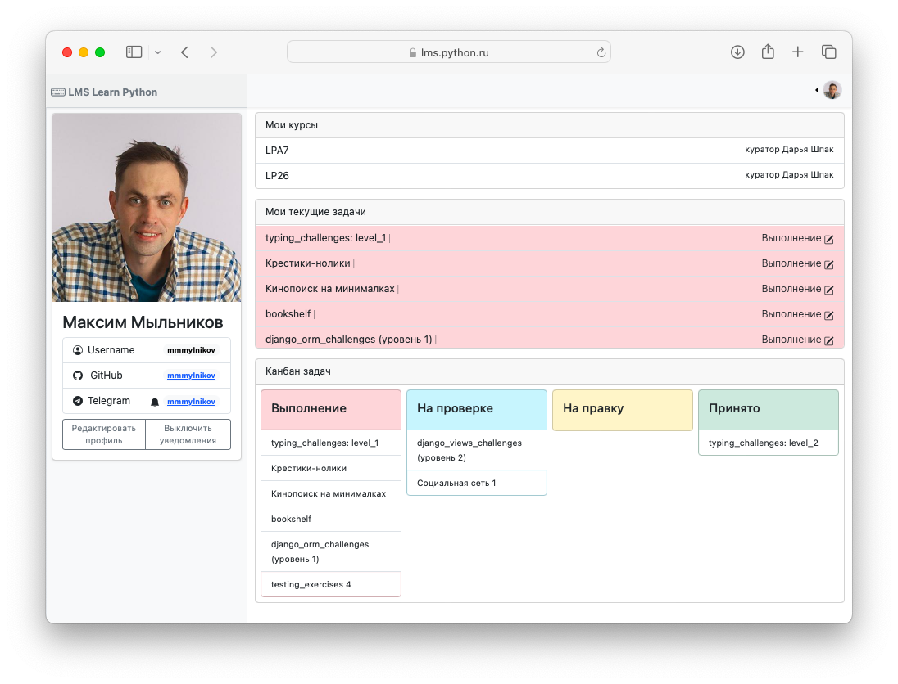
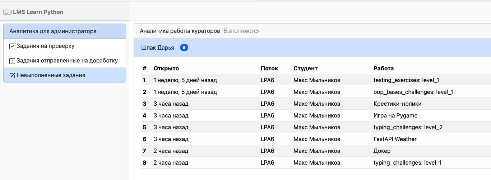

# Аналитика успеваемости 

Каждый из пользователей может оценить свой прогресс выполнения работ на курсе.

## Студент

В разделе "Мой профиль" студент может посмотреть текущие задачи и выполненные задания.

## Куратор

Для куратора доступна сводная аналитика по курируемым студентам для заданий: 

- отправленных на проверку (туду лист предстоящих ревью)
- отправленных на доработку
- невыполненных заданий

## Администратор

Администратору доступна сводная статистика работы кураторов и студентов по активным потокам курсов.

