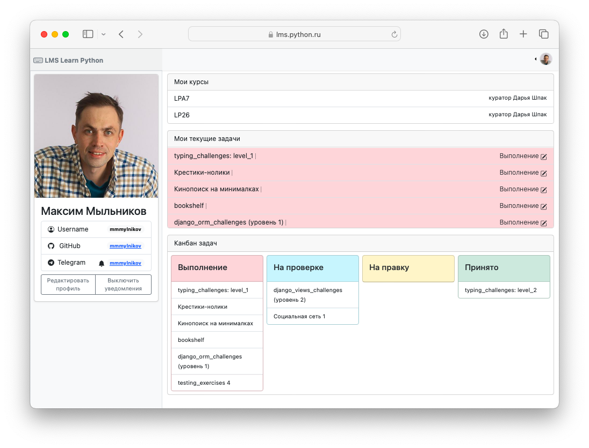

# Выполнение заданий

## Последовательность выполнения заданий

Все задания условно можно разделить задания на два типа:

- Челленджи (Тренажеры)
- Проекты (Мини проекты)

Как правило, инструкция для выполнения содержится в описании задания. Основные принципы выполнений следующие:

### Челленджи (Тренажеры)

1. Форкнуть себе репозиторий
1. Создать и перейти в бранч level_{номер_левела}
1. Выполнить упражнения из задания
1. Сделать пул-реквест в свой репозиторий
1. Сдать куратору на проверку ссылку на пул-реквест (через форму в системе)
1. Как только куратор аппрувнул пул-реквест, вмерджить его в main

### Проекты (Мини проекты)

1. Создать репозиторий
1. Создать и перейти в бранч разработки
1. Выполнить упражнения из задания
1. Сделать пул-реквест в свой репозиторий
1. Сдать куратору на проверку ссылку на пул-реквест (через форму в системе)
1. Как только куратор аппрувнул пул-реквест, вмерджить его в main

Как выглядит процесс ревью работы с точки зрения куратора, можно посмотреть в разделе [Ревью работ](../learn/review.md)

## Прогресс обучения

Студент может отслеживать текущие задачи в дашборде, а также в разделе "Мой профиль"

## Уведомления

Если Студент указал в профиле аккаунт Telegram и включил уведомления, то система будет присылать в Телеграм сообщения об изменении статуса работ

