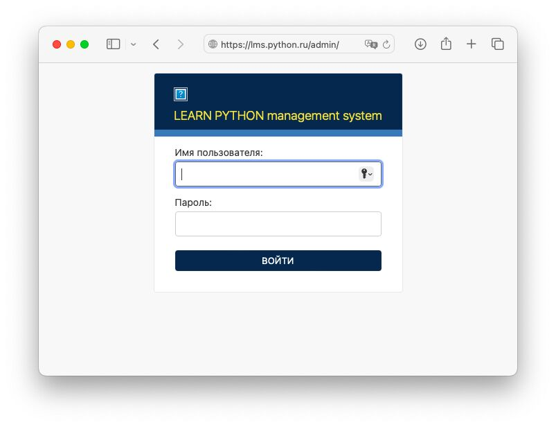
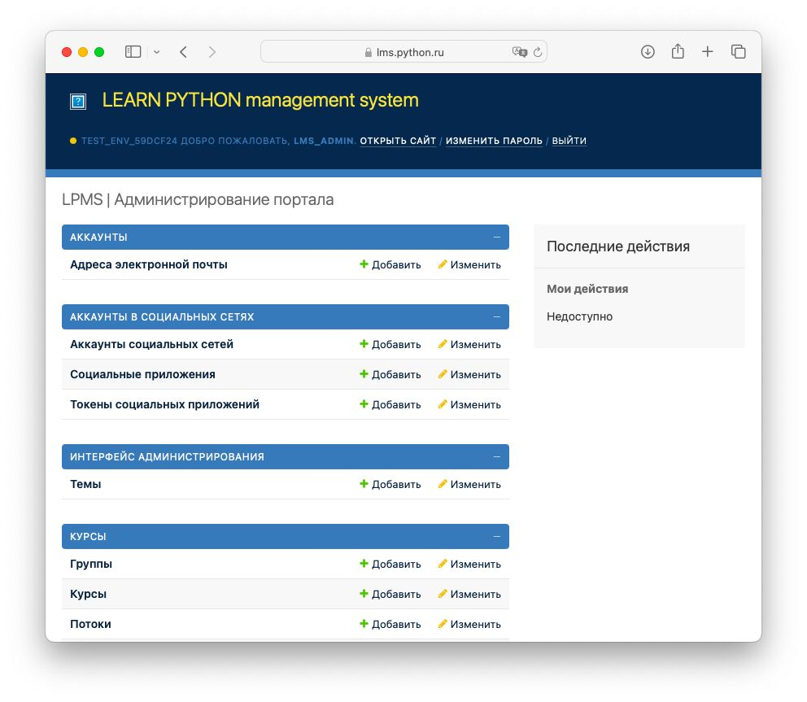

# Профиль администратора

Прежде чем приступить с наполнению системы учебным контентом, необходимо создать профиль администратора.

1) Перейдите в каталог `lpms-app`

``` bash
cd ~/lpms-app
```

2) Запустите контейнер `lpms_app-app-1` в интерактивном режиме:

``` bash title="~/lpms-app"
docker-compose run app sh
```

3) Создайте профиль администратора

``` bash title="/usr/src/app"
python manage.py createsuperuser
```

Задайте имя пользователя, адрес электронной почты и пароль.

``` bash title="/usr/src/app # python manage.py createsuperuser"
Имя пользователя: lms_admin
Адрес электронной почты: lmsadmin@python.ru      
Password: lms_admin_password
Password (again): lms_admin_password
Superuser created successfully.
```

4) Выйдите из контейнера `lpms_app-app-1`

``` bash title="/usr/src/app"
exit
```

5) Запустите систему

``` bash title="~/lpms-app"
docker-compose up
```

6) Откройте в браузере адрес входа в консоль для администратора [https://lms.python.ru/admin/](https://lms.python.ru/admin/)



7) Войдите в панель администратора используя учетный сведения указанные на третьем шаге



