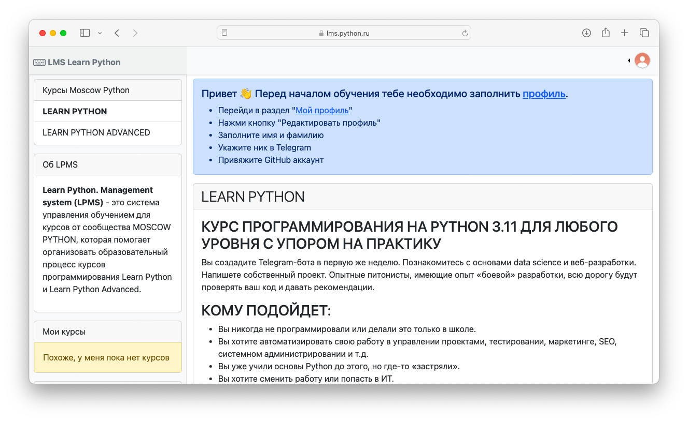
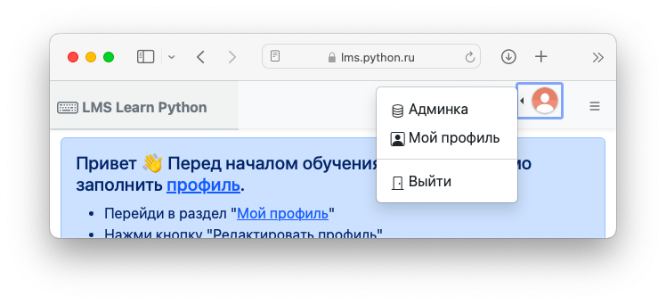
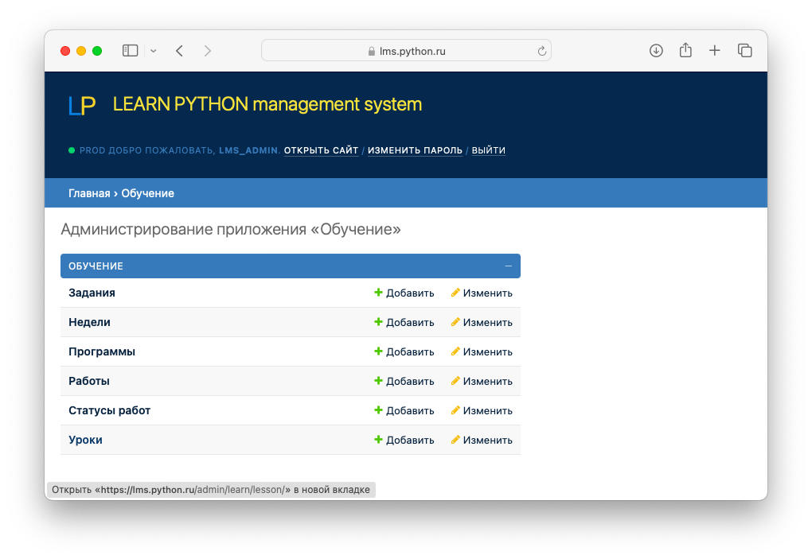
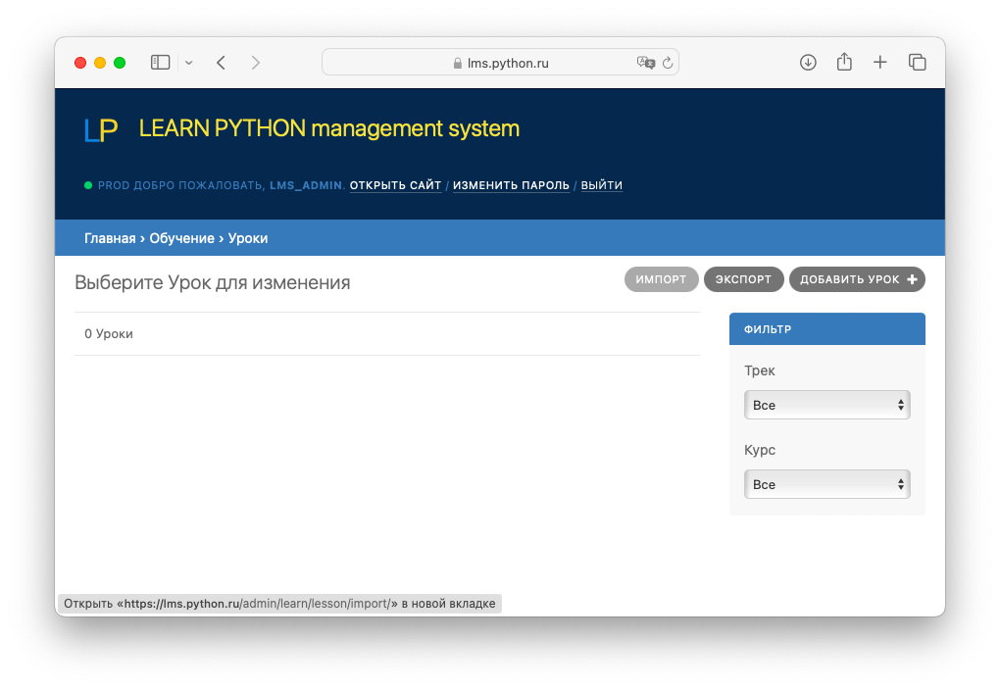
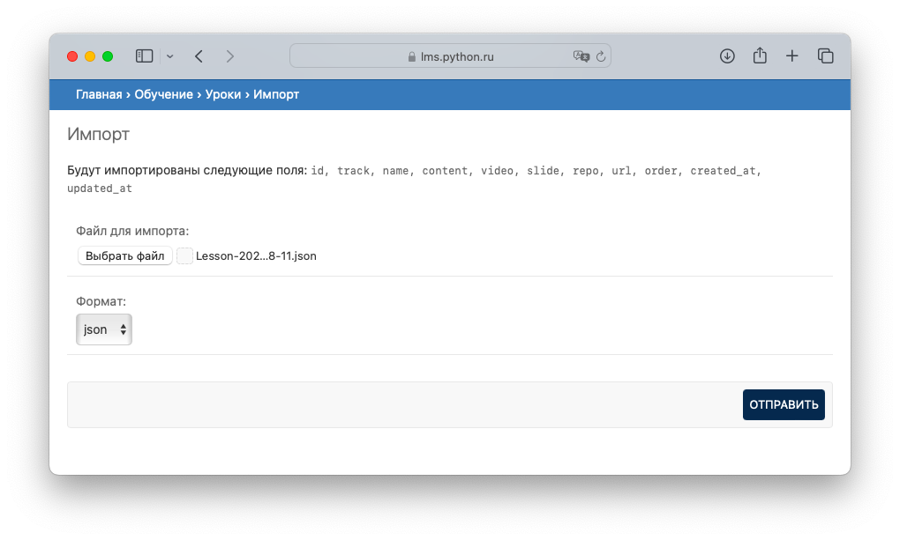
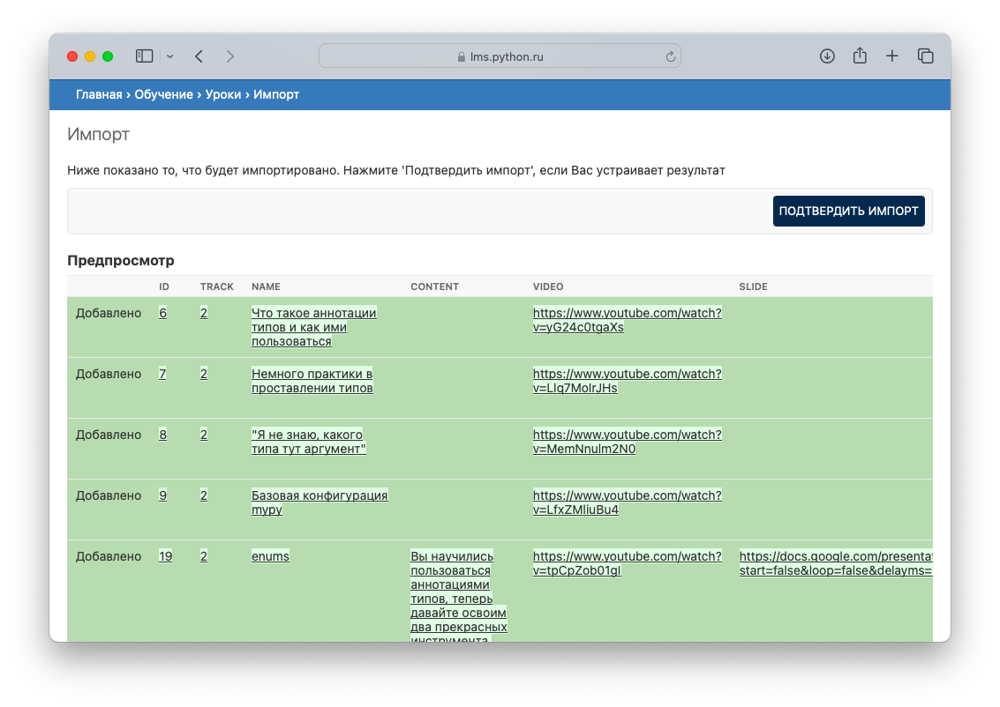
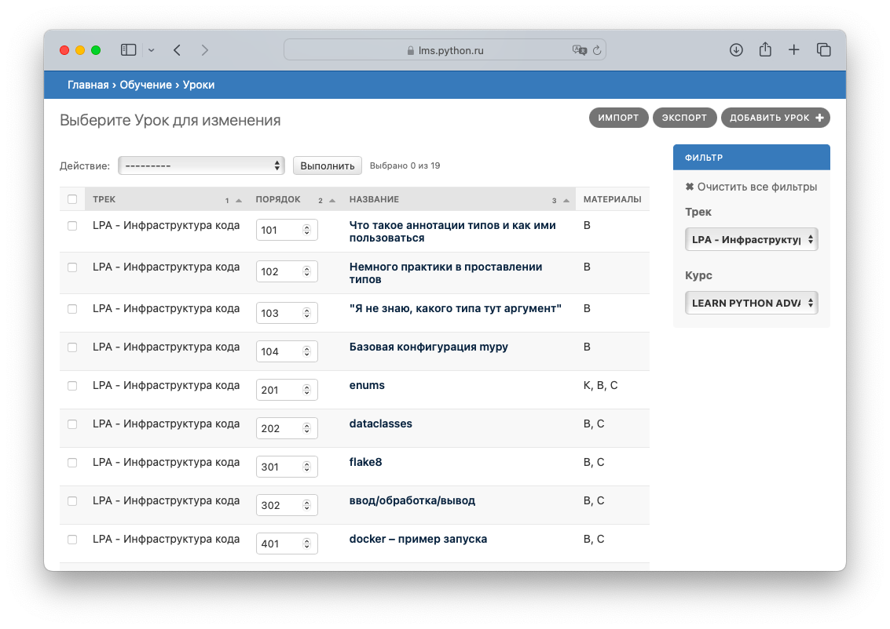
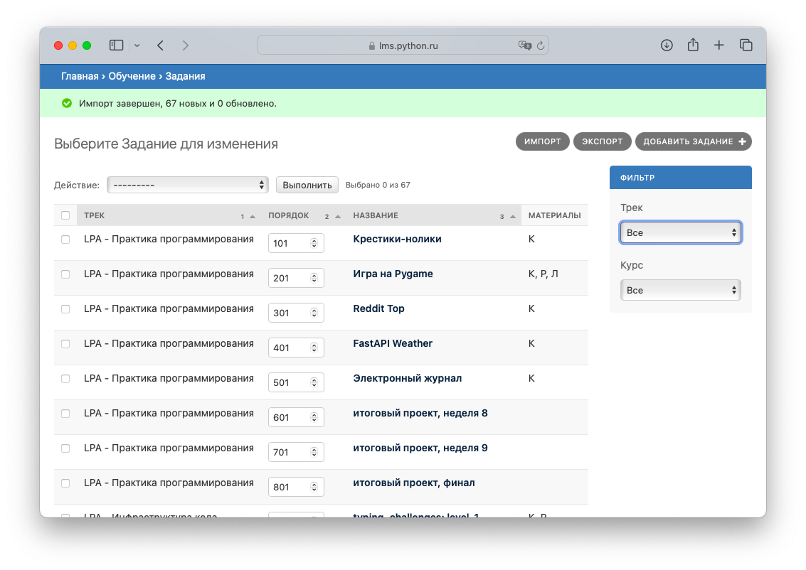
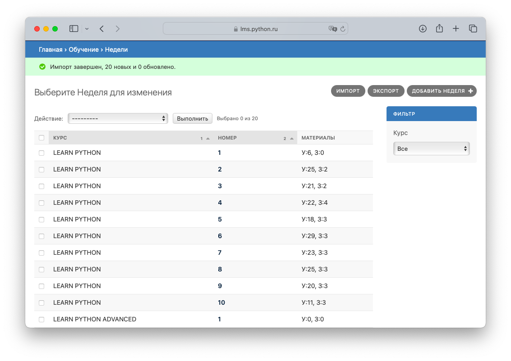
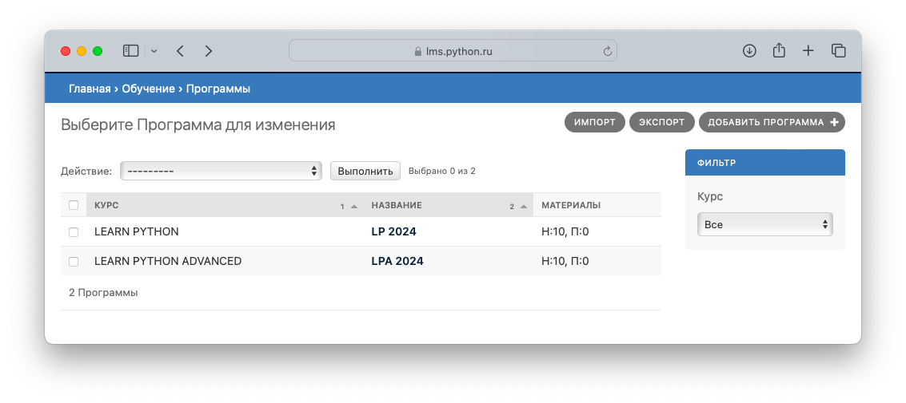

# Учебные материалы

## Как попасть в админку через интерфейс системы

1) Загрузите в браузере главную старицу системы, например `lms.python.ru`. Вы увидите лендинг курсов Learn Python и Learn Python Advanced.

2) Кликните на аватарку пользователя в правом верхнем углу и выберите "Админка".

## Загрузка уроков

1) Перейдите в раздел "Главная > Обучение > Уроки"

2) Выберите "Импорт"

3) Выберите файл из каталога `~/lpms-app/lms-dump/learn/Lesson-YYYY-MM-DD.*`. В каталоге файлы представлены в форматах `json` и `xlsx`. По содержанию они идентичны. При необходимости данные в них вы можете откорректировать перед загрузкой. После прикрепите файл и нажмите "Отправить".

4) В режиме предпросмотра вы увидите примерно следующее окно:

5) Нажмите "Подтвердить импорт". После при необходимости вы можете детально ознакомиться с загруженными уроками.

## Загрузка заданий

1) Перейдите в раздел "Главная > Обучение > Задания"

2-5) Выполните шаги 2-5 аналогично процедуре Загрузки уроков (описана выше). Файлы в каталоге: `~/lpms-app/lms-dump/learn/Challenge-YYYY-MM-DD.*`

## Загрузка недель обучения

1) Перейдите в раздел "Главная > Обучение > Недели"

2-5) Выполните шаги 2-5 аналогично процедуре Загрузки уроков (описана выше). Файлы в каталоге: `~/lpms-app/lms-dump/learn/Week-YYYY-MM-DD.*`

## Загрузка программ обучения

1) Перейдите в раздел "Главная > Обучение > Программы"

2-5) Выполните шаги 2-5 аналогично процедуре Загрузки уроков (описана выше). Файлы в каталоге: `~/lpms-app/lms-dump/learn/Program-YYYY-MM-DD.*`

!!!success "Поздравляю, все готово!"
    В следующем разделе рассмотрим как подготовить систему к старту нового учебного потока
