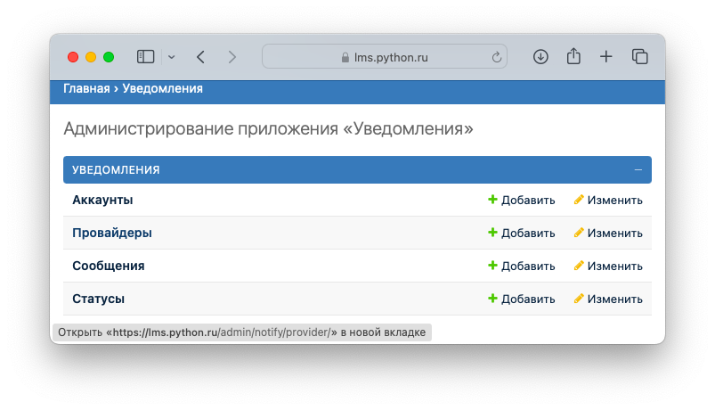
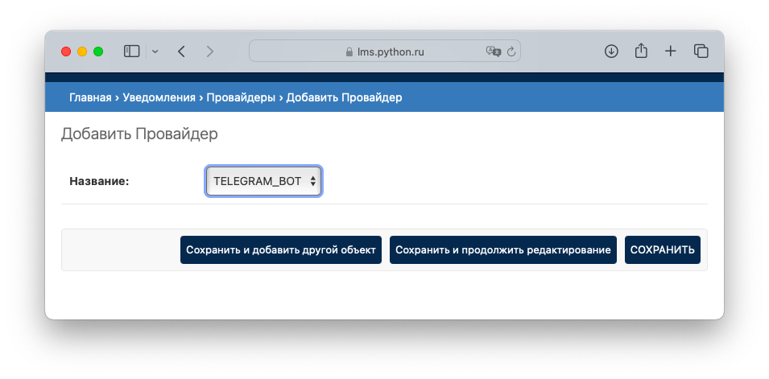

# Включение уведомлений

В системе присутствует возможность отправлять уведомления пользователям (Студентам и Кураторам). Например, когда студент отправил новую работу на проверку Куратор получит соответсвующее уведомление и напротив, когда Куратор выполнил ревью работы, Студент получит сообщение об этом.

Чтобы включить эту функциональность на уровне системы необходимо перейти в административной панели в раздел "Главная > Уведомления > Провайдеры". 

После этого создать нового провайдера. В настоящий момент поддерживается единственный провайдер - Telegram Bot.

Настройки для данного провайдера вы уже указывали в [переменных окружения](../setup/env.md).

