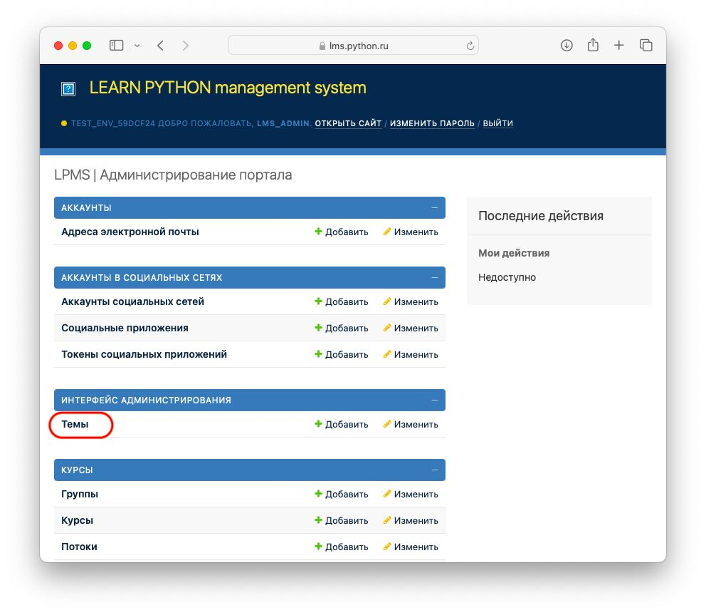
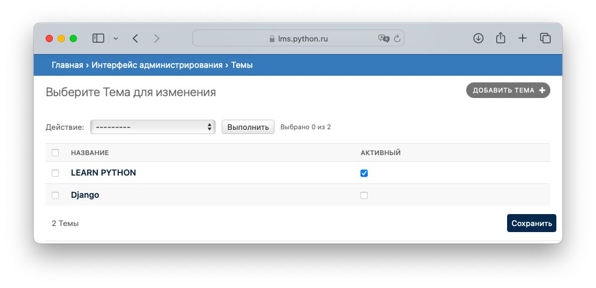
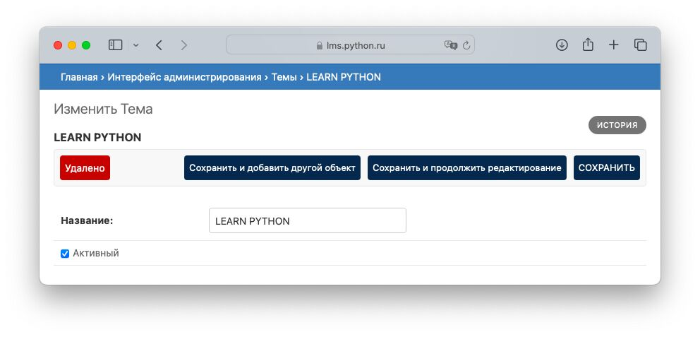
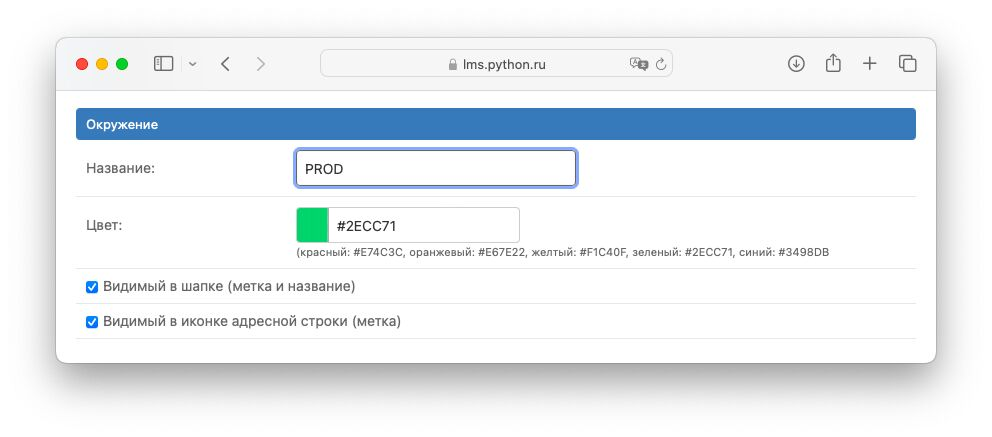
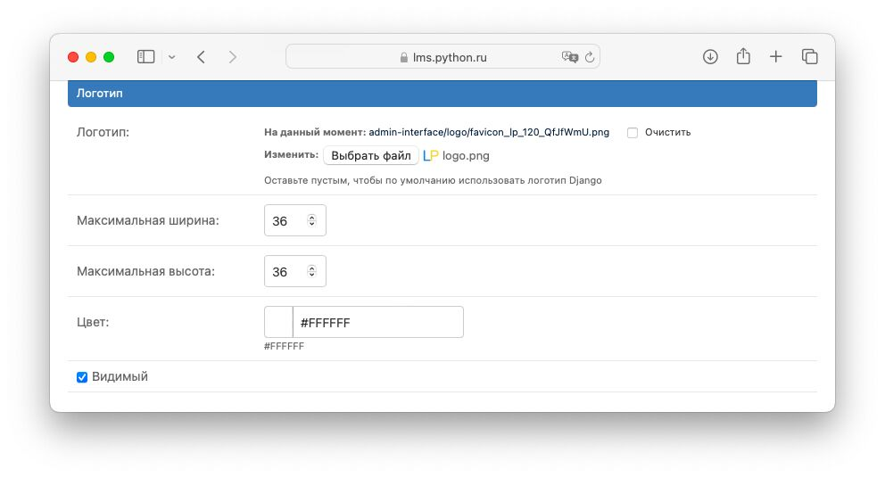
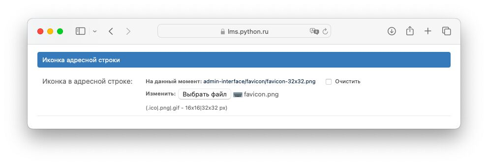
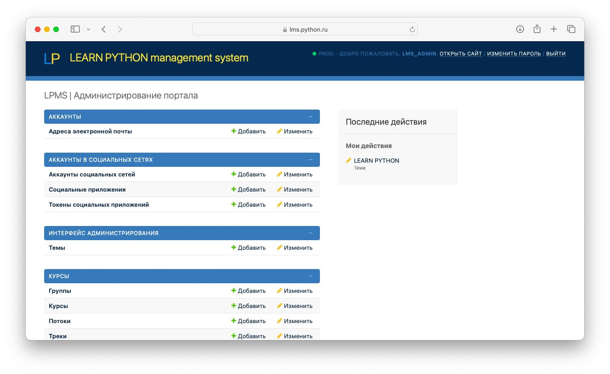

# Оформление интерфейса администрирования

Давайте настроим логотип и иконку интерфейса администрирования.

1) В интерфесе администрирования перейдите в каталог `Главная › Интерфейс администрирования › Темы › LEARN PYTHON`

2) В разделе "Окружение" измените цвет и название версии, которая будет отображаться в шапке панели администрирования

3) В разделе "Логотип" прикрепите файл из каталога `~/lpms-app/lms-dump/admin-theme/logo.png`

4) В разделе "Иконка адресной строки" прикрепите файл из каталога `~/lpms-app/lms-dump/admin-theme/favicon.png`

5) Сохраните изменения

Вы увидите примерно следующее окно:

