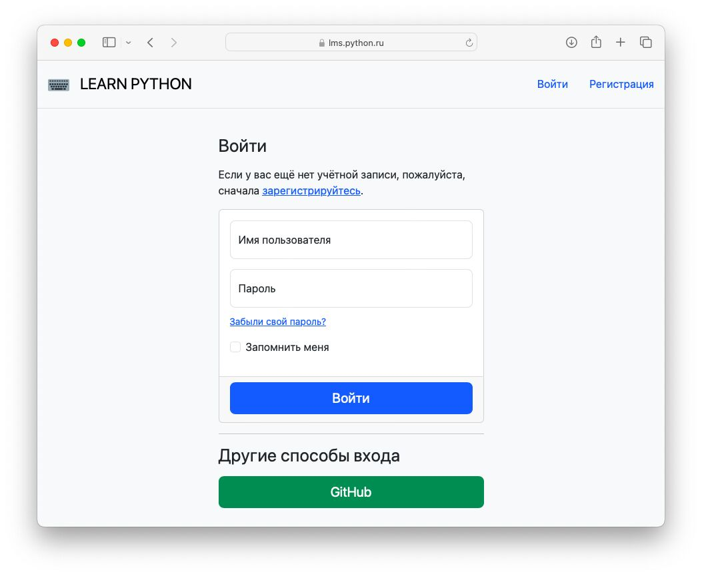

# Конфигурация NGINX

Прежде чем настроить конфигурацию NGINX, необходимо настроить подготовить сервер к подключению по протоколу HTTPS. Для этого необходимо получить сертификаты.

## Получение сертификатов

1) Установите Certbot

``` bash
sudo apt install certbot
```

2) Сгенерируйте сертификат командой заменив `lms.python.ru` на ваше имя домена.

``` bash
sudo certbot certonly --standalone -d lms.python.ru
```

Эта команда запустит собственный сервер, поэтому еобходимо чтобы порт 80 не был занят (при необходимости остановите службу на этом порту).

Если процесс завершится успешно, вы увидите сообщение о создании сертификатов (cert.pem и privkey.pem) в каталоге `/etc/letsencrypt/live/lms.python.ru/`.


## Настройка конфигурации NGINX

1) Перейдите в каталог `lpms-app`

``` bash
cd ~/lpms-app
```

2) Запустите контейнер `lpms_app-app-1` в интерактивном режиме:

``` bash title="~/lpms-app"
docker-compose run app sh
```

3) Перейдите в каталог `lpms_nginx_conf`

``` bash title="/usr/src/app"
cd shared/nginx/
```

4) Установите редактор `nano`

``` bash title="/usr/src/app/shared/nginx"
apk add nano

```
4) Откройте конфигурацию NGINX:

``` bash title="/usr/src/app/shared/nginx"
nano nginx.conf
```

5) Отредактируйте доменное имя в конфигурации NGINX. Замените `<site.ru>` на ваше имя домена, например, `lms.python.ru`. 

``` nginxconf title="/usr/src/app/shared/nginx/nginx.conf" linenums="1" hl_lines="8 14"

upstream service {
    server app:8000;
}

server {
    listen 80;
    listen [::]:80;
    return 301 https://<site.ru>$request_uri;
}

server {
        listen [::]:443 ssl ipv6only=on;
        listen 443 ssl;
        server_name <site.ru>;

        ssl_certificate /etc/nginx/conf.d/cert1.pem;
        ssl_certificate_key /etc/nginx/conf.d/privkey1.pem;

        location = /favicon.ico { access_log off; log_not_found off; }

    location /static/ {
        alias /shared/static/;
    }

    location /media/ {
        alias /shared/media/;
    }

        location / {
                proxy_pass              http://service;
                proxy_redirect          off;

                proxy_set_header        Host                    $http_host;
                proxy_set_header        X-Real-IP               $remote_addr;
                proxy_set_header        X-Forwarded-For         $proxy_add_x_forwarded_for;
                proxy_set_header        X-Forwarded-Proto       https;
        }
}

```

6) Завершите работу контейнера `lpms_app-app-1`

``` bash title="/usr/src/app/shared/nginx"
exit
```

При запуске контейнера `lpms_app-app-1` была запущена база данных. Завершите ее работу.

``` bash title="~/lpms-app"
docker compose stop db
```

7) Запустите контейнер `lpms_app-app-1` в фоновом режиме

``` bash title="/usr/src/app/shared/nginx"
docker-compose up -d app
```

8) Скопируйте сгенерированные сертификаты в каталог `lpms_nginx_conf`.

``` bash title="~/lpms-app"
docker compose cp /etc/letsencrypt/live/lms.python.ru/fullchain.pem app:/usr/src/app/shared/nginx/cert1.pem
docker compose cp /etc/letsencrypt/live/lms.python.ru/privkey.pem app:/usr/src/app/shared/nginx/privkey1.pem
```

9) Завершите работу контейнера `lpms_app-app-1` и `lpms_app-db-1`

``` bash title="~/lpms-app"
docker compose stop app db
```


10) Запустите систему 

``` bash title="~/lpms-app"
docker compose up
```

Теперь при открытии в браузере домена указанного на пятом шаге вы увидите страницу автризации для входа в систему.




## Пример конфигурации Nginx Reverse Proxy

Если необходимо запустить систему на действующем nginx сервере, то необходимо выполнить следующие шаги:

1) В файле `docker-compose.yml` отредактировать порты, так чтобы внешние порты контейнера `nginx` были например `8080` (http) и `8081` (https):

``` yml title="~/lpms-app/docker-compose.yml"  hl_lines="8 9"
version: '3.9'
services:
  ...
  nginx:
    image: nginx:latest
    restart: always
    ports:
      - 8081:80
      - 8082:443
  ...
``` 

2) В конфигурации действующего nginx сервера отредактировать конфигурацию обратного прокси-сервера, например следующим образом:

``` nginxconf title="/etc/nginx/sites-enabled/your_domain_conf" 
server {
  listen 80;
  server_name *.python.ru python.ru;

   if ($host = lms.python.ru) {
     return 302 https://$host$request_uri;
   }
  return 404;
}


server {
    server_name lms.python.ru;

    location / {
        # try_files $uri $uri/ =404;
        proxy_pass "https://localhost:8081/";
        proxy_set_header 	Host			$http_host;
		proxy_set_header	X-Real-IP		$remote_addr;
		proxy_set_header	X-Forwarded-For		$proxy_add_x_forwarded_for;
		proxy_set_header	X-Forwarded-Proto	https;
    }

    # listen [::]:443 ssl ipv6only=on; 
    listen 443 ssl;

    ssl_certificate /etc/letsencrypt/live/lms.python.ru/fullchain.pem;
    ssl_certificate_key /etc/letsencrypt/live/lms.python.ru/privkey.pem;

    include /etc/letsencrypt/options-ssl-nginx.conf;
    ssl_dhparam /etc/letsencrypt/ssl-dhparams.pem;

}
```

