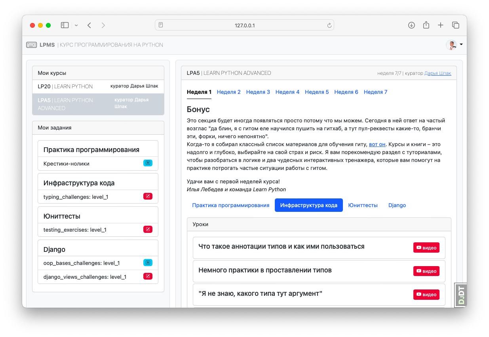
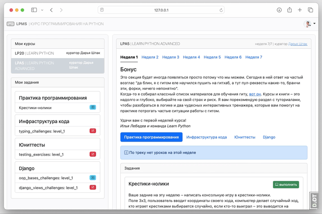
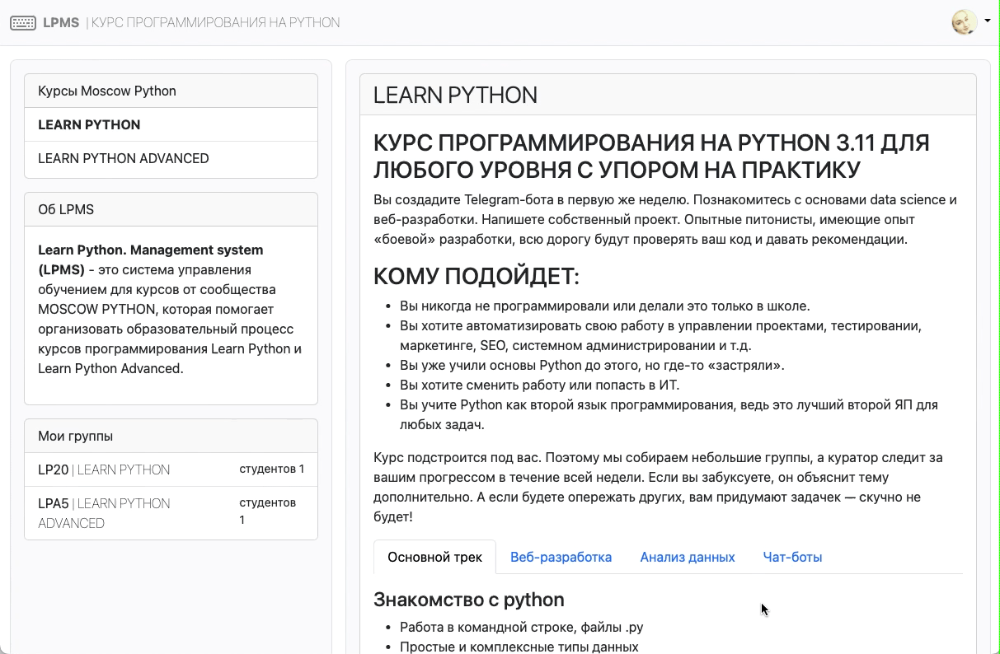
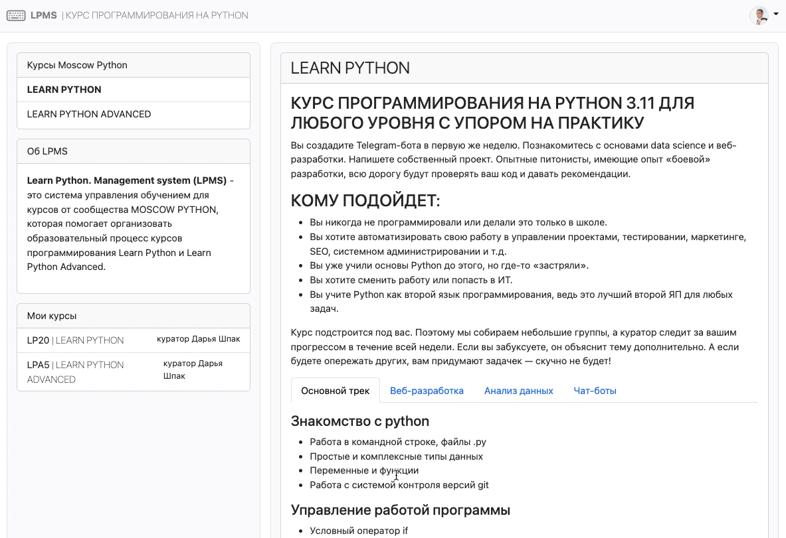
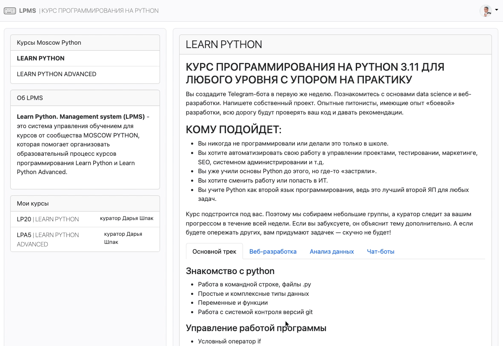
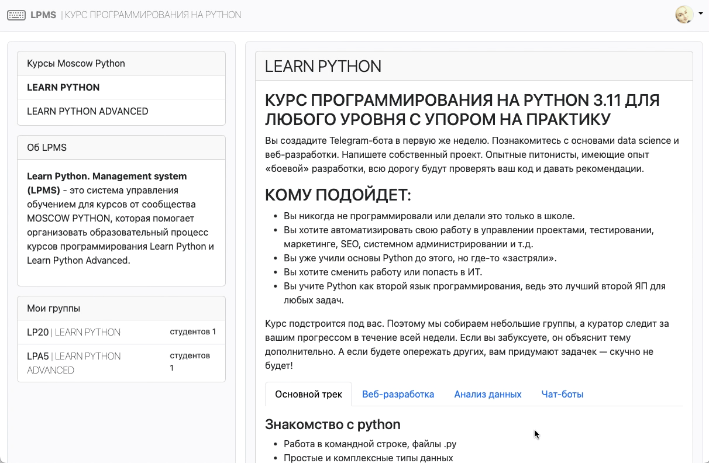

# Обучение

## Дашборд материалов обучения

> доступно Студенту и Куратору

| Недели      | Контент  |
|-------------|----------|
|| |

## Дашборд Студента

| Список задач | Выполнение задачи |
|--------------|-------------------|
|| |

## Дашборд Куратора

| Материалы, студенты, список ревью | Ревью работы студента |
|--------------|-------------------|
|| |

## Если работа требует правки

| Выполнение работы | Первое ревью и отправка на доработку |
|--------------|-------------------|
|| |

| Исправление и повторная отправка | Второе ревью и аппрув |
|--------------|-------------------|
|| |